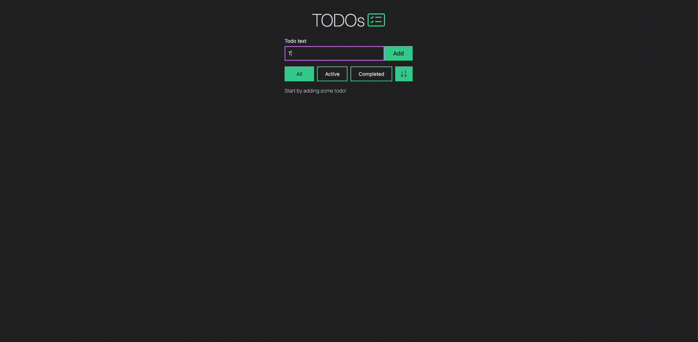

# Vuedo

This is a simple todo app made with Vue. It uses the experimental reactivity transform, Pinia and UnoCSS. Smooth and pretty animations provided by FormKit Autoanimate.

## Live version

You can check out the game [here](https://vuedo-nu.vercel.app/).

## Run it locally

- Clone repo
- Make sure `pnpm` is installed
- Run `pnpm i`
- Run `pnpm dev`

## Functionalities

- Simple todo list with possibilites of sorting and filtering todos
- Saving todos into local storage and syncing it between tabs
- Fully keyboard navigatable and accessible

## Feedback

Any feedback is appreciated. Feel free to head me up.

## License

[MIT](https://choosealicense.com/licenses/mit/)
